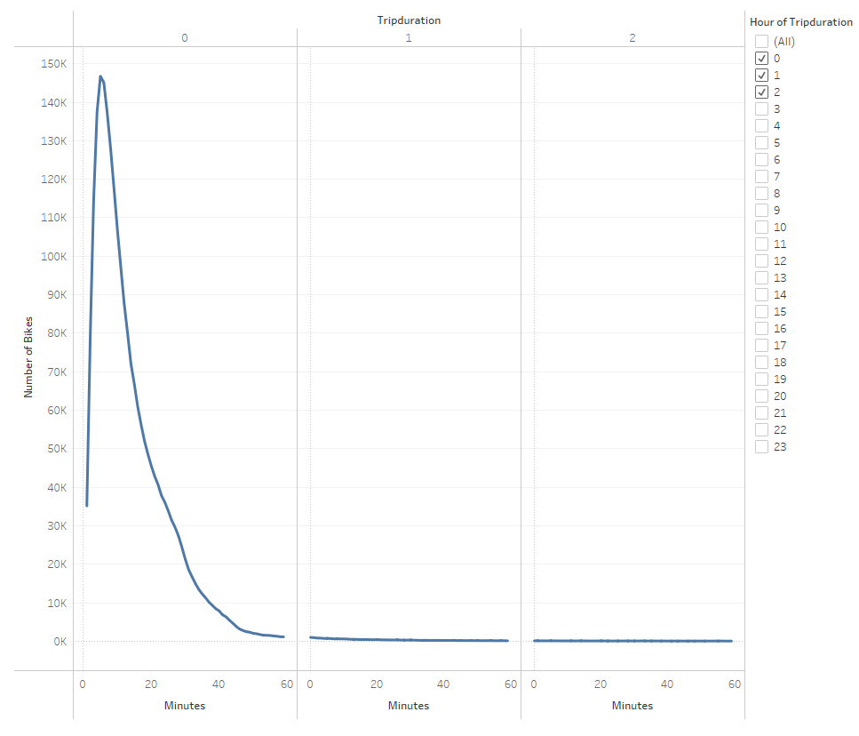

# Bikesharing
## Pverview of the Analysis
Our goal is to create a story to persuade investors that adding a bike-sharing program in Des Moines, Iowa is a good idea. Let's dive into bike trip duration analysis. First, we need to change from integer to datetime datatype the "tripduration" column. From there, we will create visualizations to show the analysis of tripduration of bikeriders and then break down the visuals by gender.
## Results

### Tableau Story

## Summary
