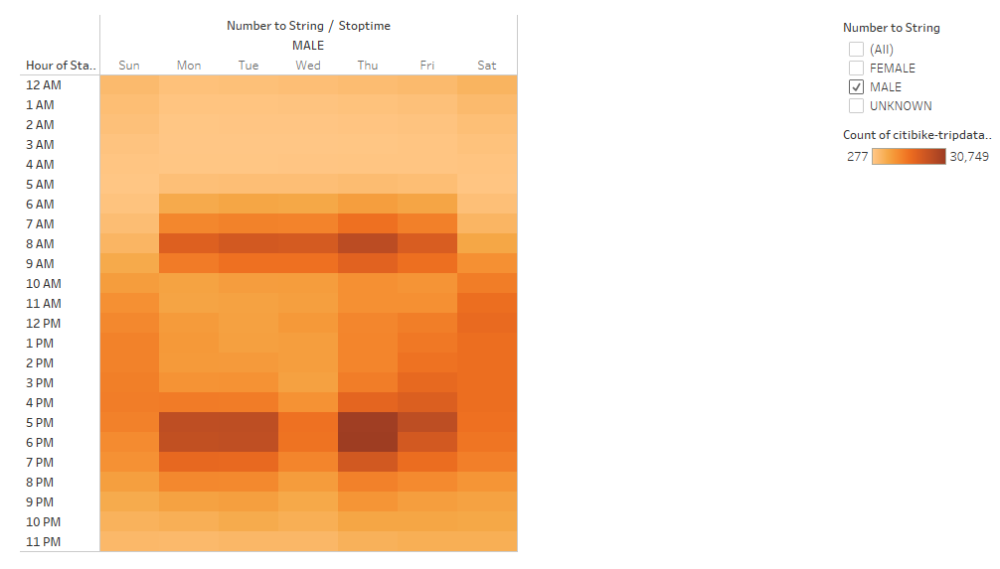
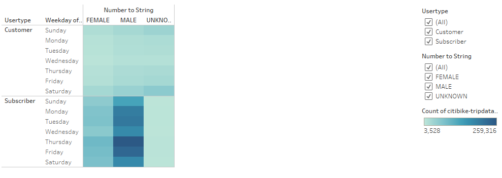
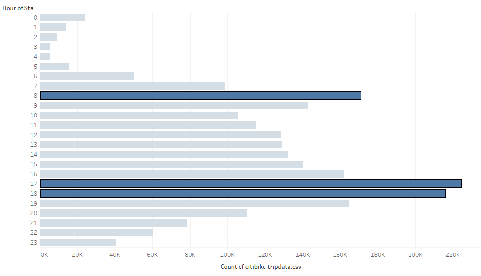

# Bikesharing
## Pverview of the Analysis
Our goal is to create a story to persuade investors that adding a bike-sharing program in Des Moines, Iowa is a good idea. Let's dive into bike trip duration analysis. First, we need to change from integer to datetime datatype the "tripduration" column. From there, we will create visualizations in Tableau to show the analysis of tripduration of bike riders and then break down the visuals by gender.
## Results
\
The majority of riders ride their bikes under 40 minutes.\
\
Males ride more than other genders, but the majority still ride under 40 minutes. From the "Gender Breakdown" pie chart, we can see that the majority of Citibike users are male.\
\
We can see from this heat map that most of the riders stop at 8 a.m., 5 p.m., and 6 p.m.\
\
The male heat map looks almost identical as the heat map with all genders. This is not surprising because we know from our "Gender Breakdown" pie chart that the majority of riders are male.\
\
Here we can see that the majority of riders use Citibike on Thursdays and Fridays. We also notice again that the majority of riders are male.
\
The majority of riders start their bike trips at 8 a.m., 5 p.m., and 6 p.m.
### Tableau Story
[Biksharing Story](https://public.tableau.com/views/Challenge14_16329379724140/BikesharingProposal?:language=en-US&:display_count=n&:origin=viz_share_link)
## Summary
In conclusion, we know the majority of users are male. We know this from the "Gender Breakdown" pie chart along with other visuals that compare genders. We also found out that the majority of riders both start and end their bike trips at 8 a.m., 5 p.m., and 6 p.m. From the "Checkout Times for Users" bar chart, we know that the majority of riders ride their bikes under 40 minutes. Therefore, we can speculate that the riders that start their bike trip at 8 a.m. end their trip during the 8 o'clock hour. Lastly, we know the majority of users ride their bikes on Thursdays and Fridays. We could speculate that riders are riding bikes to work those days as the majority of work hours are from 9 a.m. to 5 p.m.. There are two more visuals I would create with the dataset. I would create a bar graph showing the distribution of birth year per gender. The other graph would show a breakdown of gender and usertype. This would show how many are subscribers and customers there are per gender.
