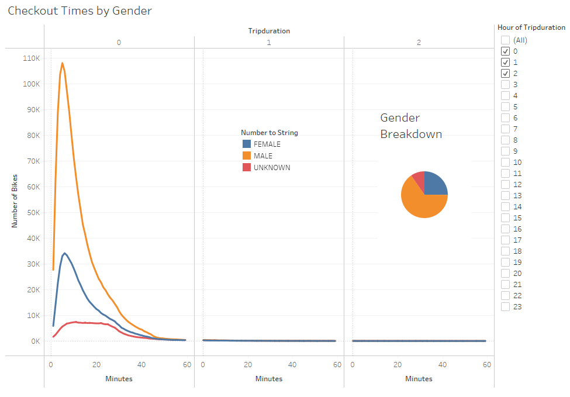
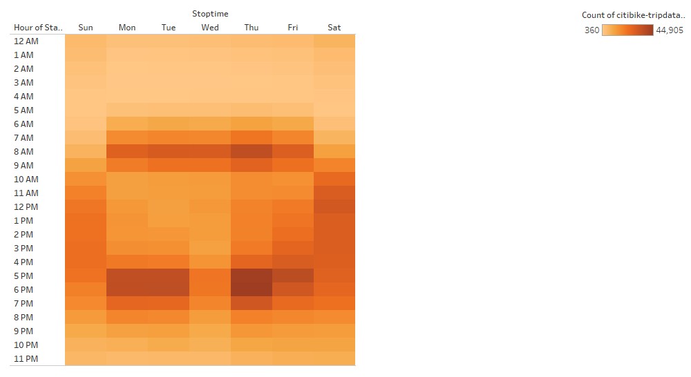

# Bikesharing
## Pverview of the Analysis
Our goal is to create a story to persuade investors that adding a bike-sharing program in Des Moines, Iowa is a good idea. Let's dive into bike trip duration analysis. First, we need to change from integer to datetime datatype the "tripduration" column. From there, we will create visualizations to show the analysis of tripduration of bikeriders and then break down the visuals by gender.
## Results
\
The majority of riders ride their bikes under 40 minutes.\
\
Males ride more than other genders, but the majority still ride under 40 minutes. From the Gender Breakdown pie chart, we can see that the majority of Citibike users are male.\
\
We can see from this heat map that most of the riders stop at 8 a.m., 5 p.m., and 6 p.m..\
### Tableau Story

## Summary
